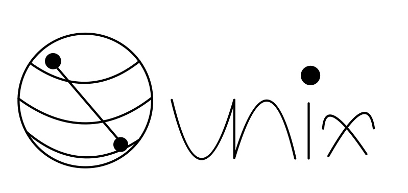

# QuNiX

QuNiX is a project of Unix like python programs by using Qiskit and Quantum Circuit with following [Unix Philosophy](https://en.wikipedia.org/wiki/Unix_philosophy)

- Programs use [**MicroQiskit**](https://github.com/qiskit-community/MicroQiskit) and [**Qiskit**](https://github.com/Qiskit/qiskit)

## Program List

### [Quantum Circuit Builder(QCB)](https://github.com/echo724/qunix/tree/main/qcb)

### [QCB_Draw](https://github.com/echo724/qunix/tree/main/qcb_draw)

### [Alea](https://github.com/echo724/qunix/tree/main/alea)

### [QArt](https://github.com/echo724/qunix/tree/main/qart)

### [QSay](https://github.com/echo724/qunix/tree/main/qsay)

## Usage

### In Terminal
```
$pip install qunix-tools

$qcb -q 3 -c 3 "h 0 h 1 h 2 m ."

$qcb_draw -q 2 -c 2 "h 0 h 1 m ."

$alea -f happy
```

## Slack Implementation

### Qiri

By running our programs as backend of Slack Bot, Qiri will get the input from the chat to it, and give us the output of programs.
This means we can run the **QCB** and **Alea** anytime we want in Slack.

Share the result of qauntum computation and qauntum quotes randomly selected by measuring superposition of qubits

---
### This project is for IBM's [Qiskit-Hackerthon-Korea-2021](https://github.com/qiskit-community/qiskit-hackathon-korea-21)
---

## Credit

Qiskit(https://github.com/Qiskit/qiskit)

MicroQiskit(https://github.com/qiskit-community/MicroQiskit)

## Licencse

[Apache License 2.0](LICENSE)
